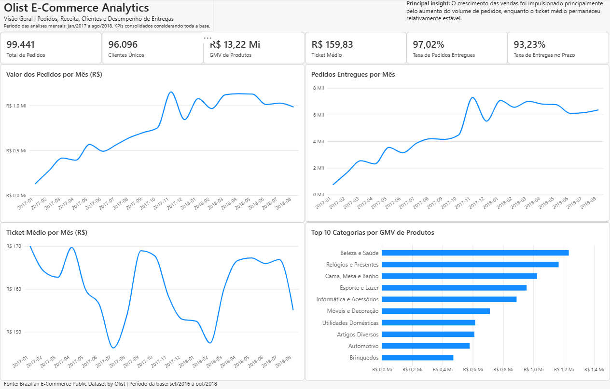
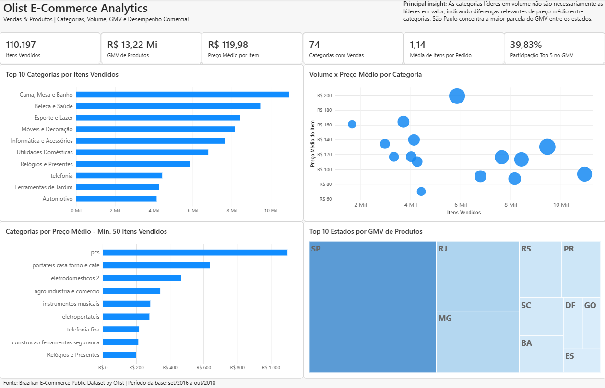
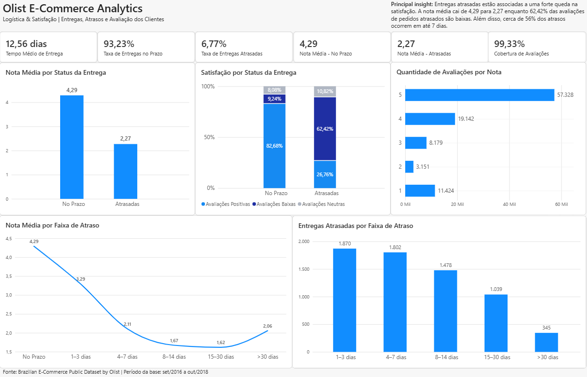

# Olist E-Commerce Analytics

End-to-end e-commerce data analytics project using **PostgreSQL, SQL, Power Query, DAX, and Power BI**, based on the Brazilian Olist public dataset.

The project covers the full analytics workflow: data loading, validation, data quality checks, business analysis, analytical modeling, KPI development, dashboard creation, and SQL-to-Power BI validation.

📄 **Full project documentation:** [Projeto_Olist_Analytics.pdf](docs/Projeto_Olist_Analytics.pdf)

The complete documentation includes data validation, data quality rules, business definitions, analytical modeling decisions, SQL results, Power BI methodology, and KPI validation.

---

## Project Overview

The objective of this project is to transform a public e-commerce dataset into a reliable analytical solution capable of answering business questions related to:

- Sales performance
- Customer behavior
- Product categories
- Geographic distribution
- Delivery performance
- Customer satisfaction

The dataset contains approximately **100k orders**, distributed across **9 tables** and more than **1.5 million records**.

**Dataset period:** September 2016 to October 2018  
**Main trend-analysis window:** January 2017 to August 2018

---

## Tech Stack

| Technology | Usage |
|---|---|
| PostgreSQL | Relational database and data storage |
| SQL | Data validation, data quality checks, transformations, and business analysis |
| Power Query | Data preparation and analytical layer construction |
| DAX | KPI and measure development |
| Power BI | Data modeling, dashboards, and storytelling |
| GitHub | Version control and portfolio documentation |

---

## Project Workflow

```text
Raw Data
   ↓
PostgreSQL
   ↓
Data Validation
   ↓
Data Quality
   ↓
Business Analysis with SQL
   ↓
Power Query / Analytical Modeling
   ↓
DAX Measures
   ↓
Power BI Dashboard
   ↓
SQL × Power BI KPI Validation
```

---

## Data Validation & Data Quality

Before building the analytical layer, the dataset was audited to verify whether it was suitable for business analysis.

### Data Validation

The validation process covered four areas:

1. **Volume** — confirmation that all 9 tables were loaded correctly.
2. **Duplicates** — validation of simple and composite keys.
3. **Null values** — identification and interpretation of missing data.
4. **Referential integrity** — identification of orphan records between related tables.

### Main validation results

- **0 duplicate keys** across the 8 tables with defined unique keys.
- **0 orphan records** in the main relationships.
- 13 products from 2 categories without an English category translation.
- Missing timestamps were analyzed according to `order_status` instead of being automatically removed.

### Data Quality

Eight business consistency rules were evaluated, including:

- Order timeline consistency
- Status vs. timestamp consistency
- Financial values
- Review scores
- Product physical attributes
- Order status validity
- Order value vs. payment consistency
- Geographic consistency

Key findings:

- **189 orders** with timeline inconsistencies.
- **99.69%** of comparable orders financially consistent within a R$ 0.01 tolerance.
- **4 products** with zero weight.
- All review scores valid within the expected **1–5** range.

The project follows a **non-destructive data-quality approach**: anomalies are preserved in the raw layer and excluded only from KPIs directly affected by the issue.

---

## Business Rules

| Metric / Rule | Definition |
|---|---|
| Completed orders | `order_status = 'delivered'` when the metric depends on completed sales |
| Product GMV | Sum of `order_items.price`; freight excluded |
| Total Order Value | Sum of product price + freight at order level |
| AOV | Average Total Order Value after aggregation by `order_id` |
| Unique customers | Based on `customer_unique_id` |
| On-Time Delivery | Delivery date equal to or earlier than estimated delivery date |
| Multiple reviews | Aggregated to `order_id` for order-level satisfaction analysis |
| Review distribution | Uses the original review-level grain in `fact_reviews` |
| Trend window | Jan/2017 to Aug/2018 |
| Category average price ranking | Minimum of 50 items sold to reduce low-volume distortion |

---

## Analytical Model

### Fact tables

- `fact_orders` — order-level metrics, logistics, aggregated order values, and satisfaction.
- `fact_order_items` — item-level product, seller, quantity, and GMV analysis.
- `fact_reviews` — individual review-level distribution.

### Dimensions

- `dim_customer`
- `dim_product`
- `dim_seller`
- `dim_date`

DAX measures are centralized in a dedicated **Measures** table.

---

# Power BI Dashboard

## 1. Overview

**Business question:** How did the marketplace perform overall?

Main KPIs include:

- 99,441 total orders
- 96,096 unique customers in the full dataset
- R$ 13.22M Product GMV
- R$ 159.83 average order value
- 97.02% delivered-order rate
- 93.23% on-time delivery rate

The monthly analysis shows that growth was driven primarily by increasing order volume, while average order value remained relatively stable.



---

## 2. Sales & Products

**Business question:** Which categories and regions generate volume and value?

Key metrics:

- 110,197 items sold
- R$ 13.22M Product GMV
- R$ 119.98 average item price
- 74 categories with sales
- 1.14 average items per order
- Top 5 categories account for **39.83%** of Product GMV

For the average-price ranking, only categories with **at least 50 items sold** are included to reduce distortion from very low-volume categories.



---

## 3. Logistics & Customer Satisfaction

**Business question:** How is delivery performance associated with customer satisfaction?

Main KPIs:

- 12.56 days average delivery time
- 93.23% on-time delivery rate
- 6.77% late-delivery rate
- 4.29 average review score for on-time orders
- 2.27 average review score for late orders
- 99.33% review coverage among delivered orders

The analysis shows a strong association between delivery delays and lower customer satisfaction.

- Average review score falls from **4.29 for on-time orders to 2.27 for late orders**
- Approximately **56.20% of late deliveries occur within 7 days after the estimated delivery date**

This analysis demonstrates **association, not causality**.



---

## Key Business Insights

- From Jan–Aug 2017 to Jan–Aug 2018, delivered orders increased **139.94%** and Total Order Value increased **143.36%**, while AOV increased only **1.42%**.
- Customer repeat behavior is low within the observed period: **3.00% repeat-customer rate** among customers with delivered orders.
- Shopping baskets are small: **90.01%** of orders contain one item and **97.67%** contain at most two.
- Category leaders differ depending on the metric: `bed_bath_table` leads item volume, while `health_beauty` leads Product GMV.
- São Paulo represents **41.98% of delivered orders** and **38.33% of Product GMV**.
- SP, RJ, and MG together account for **66.55% of delivered orders**.
- Delivery performance is strongly associated with customer satisfaction: average review score falls from **4.29** for on-time orders to **2.27** for late orders.

---

## Repository Structure

```text
olist-ecommerce-analytics/
│
├── sql/
│   ├── 01_schema.sql
│   ├── 02_data_validation.sql
│   ├── 03_data_quality.sql
│   └── 04_business_analysis.sql
│
├── dashboard/
│   ├── Olist_Ecommerce_Analytics.pbix
│   └── images/
│       ├── Dashboard01_visaogeral.png
│       ├── Dashboard02_vendaseprodutos.png
│       └── Dashboard03_logisticaesatisfacao.png
│
├── docs/
│   └── Projeto_Olist_Analytics.pdf
│
└── README.md
```

---

## SQL Files

### `01_schema.sql`

Creates the PostgreSQL database structure for the 9 source tables.

### `02_data_validation.sql`

Validates:

- Record volumes
- Duplicate keys
- Null values
- Referential integrity

### `03_data_quality.sql`

Applies the 8 Data Quality rules and documents identified anomalies.

### `04_business_analysis.sql`

Contains the SQL queries used to calculate and validate the business KPIs used throughout the project and Power BI dashboard.

---

## How to Reproduce

1. Download the **Brazilian E-Commerce Public Dataset by Olist** from Kaggle.
2. Create a PostgreSQL database named `olist_analytics`.
3. Run `sql/01_schema.sql`.
4. Import the 9 source CSV files into the corresponding PostgreSQL tables.
5. Execute `sql/02_data_validation.sql` and `sql/03_data_quality.sql`.
6. Run `sql/04_business_analysis.sql`.
7. Open `dashboard/Olist_Ecommerce_Analytics.pbix`.
8. If necessary, update the PostgreSQL connection settings in Power BI to point to your local database.

> Raw CSV files are not stored in this repository. They can be downloaded from the original Olist dataset on Kaggle.

---

## Methodological Notes

- Historical dataset: results describe the period available in the dataset and should not be interpreted as current Olist performance.
- The main monthly trend window uses Jan/2017–Aug/2018 to reduce distortion from residual or incomplete periods.
- Data-quality anomalies were documented and preserved whenever possible instead of being automatically removed.
- Logistics and review analysis identifies associations, not causal effects.
- SQL was used as the reference layer for validating the main Power BI KPIs.

---

## Author

**Renato Marcondes de Souza**

Data Analytics portfolio project focused on SQL, PostgreSQL, data quality, analytical modeling, DAX, and Power BI.

LinkedIn: https://www.linkedin.com/in/renato-m-souza/
